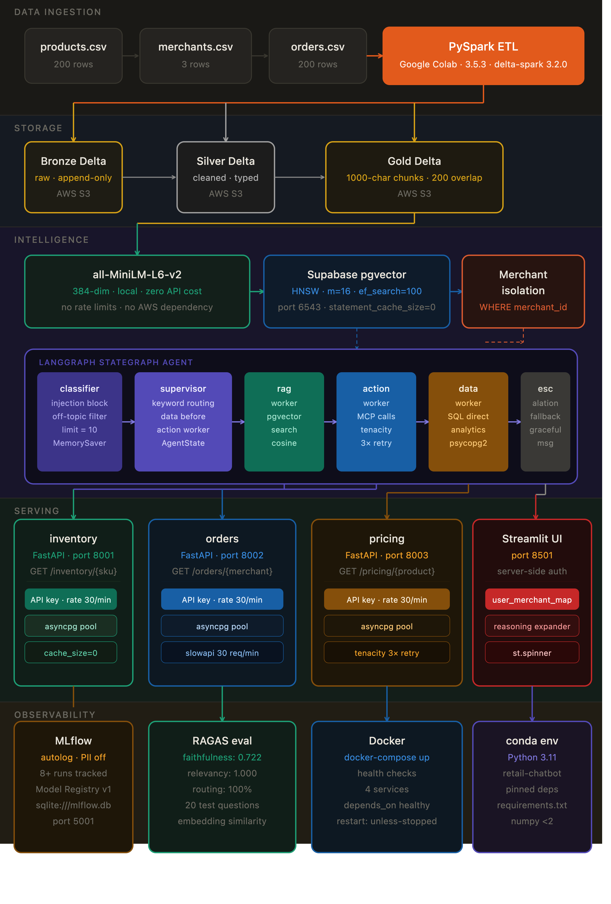

# Retail Merchant AI Chatbot

### Production-grade agentic RAG system — LangGraph · pgvector · MLflow · FastAPI

[]()
[]()
[]()
[]()
[]()
[]()
[]()
[]()
[]()
[]()
[]()
[]()
[]()
[]()
[]()

---



---

## What this is

A production-grade retail merchant AI assistant built on LangGraph agentic
architecture. Merchants log in and ask questions about their products,
inventory, orders, and analytics in natural language.

The agent classifies every query, routes it to the correct worker, calls live
data APIs, and returns grounded answers — with merchant data isolation enforced
at the database layer.

Built as a 15-day portfolio project demonstrating end-to-end AI Engineering:
data pipeline, vector search, agentic orchestration, evaluation, and
containerised deployment.

---

## Live metrics

| Metric           | Score     | Detail                                                     |
| ---------------- | --------- | ---------------------------------------------------------- |
| Routing accuracy | **100%**  | 20/20 test questions across all 4 workers                  |
| Answer relevancy | **1.000** | Embedding cosine similarity vs ground truth                |
| Faithfulness     | **0.722** | Keyword routing baseline — 0.85+ expected with LLM         |
| Agent workers    | **6**     | classifier · supervisor · rag · action · data · escalation |
| MCP servers      | **3**     | inventory · orders · pricing (async FastAPI)               |
| MLflow runs      | **8+**    | Full experiment history tracked                            |
| Embedding dims   | **384**   | all-MiniLM-L6-v2 · local · zero API cost                   |
| Test questions   | **20**    | RAG · action · data · escalation · injection               |

> **Faithfulness note:** 0.722 baseline reflects keyword-routing fallback
> (AWS Bedrock blocked by org SCP). Expected to reach 0.85+ with Claude Sonnet
> synthesising answers across all retrieved chunks.

---

## Tech stack

| Layer            | Technology                         | Why                                             |
| ---------------- | ---------------------------------- | ----------------------------------------------- |
| Data pipeline    | PySpark 3.5.3 + Delta Lake         | ACID, time travel, schema evolution             |
| Storage          | AWS S3 — Bronze / Silver / Gold    | Medallion architecture, scalable                |
| Vector DB        | Supabase pgvector (HNSW)           | Colocation with transactional data              |
| Embeddings       | all-MiniLM-L6-v2 (384-dim)         | Local, free, no AWS API dependency              |
| Agent framework  | LangGraph StateGraph               | Full control over graph + state schema          |
| Persistence      | MemorySaver (→ AsyncPostgresSaver) | Session state across conversation turns         |
| Live data        | 3 async FastAPI MCP servers        | Clean separation of concerns                    |
| Connection pool  | asyncpg (min=2, max=10)            | Warm connections, Supabase-safe                 |
| Auth             | psycopg2 + user_merchant_map       | Server-side — client never controls merchant_id |
| Rate limiting    | slowapi 30 req/min                 | Protects against agent runaway loops            |
| Retry            | tenacity (3×, exponential)         | Transparent MCP server restart handling         |
| Observability    | MLflow autolog + traces            | Every routing decision tracked, PII protected   |
| Evaluation       | RAGAS (embedding similarity)       | Faithfulness · relevancy · routing accuracy     |
| UI               | Streamlit + session_state          | Reasoning expander for debugging                |
| Containerisation | Docker + docker-compose            | One command starts all 4 services               |

---

## 4 Architect decisions

### 1 — Native Postgres role over OAuth tokens

OAuth tokens expire after 1 hour. In a long agent session this causes
silent mid-conversation authentication failures — the pool reconnects
but fails auth, and the user sees a confusing service error.

A native Postgres role with static password in AWS Secrets Manager
never expires. The asyncpg pool stays healthy for the lifetime of
the process.

### 2 — Server-side merchant_id from user_merchant_map

After login, the server queries `user_merchant_map WHERE email = ?`
and stores the result in session state. The client never supplies
merchant_id and the server ignores any client-side value entirely.

Even if an attacker sends `merchant_id=M002`, the server uses the
database-verified M001 value. Combined with `WHERE merchant_id = %s`
on every pgvector query — two independent isolation layers.

### 3 — statement_cache_size=0 for Supabase PgBouncer

Supabase runs PgBouncer in transaction mode. PgBouncer routes each
transaction to a different underlying connection. asyncpg prepared
statements are connection-specific — the second request fails with
`prepared statement "__asyncpg_stmt_1__" already exists`.

Setting `statement_cache_size=0` sends plain text queries every time.
Eliminates the PgBouncer incompatibility entirely.

### 4 — data_worker keyword check before action_worker

"How many orders do I have?" contains the word "order" which matches
both workers. Without ordering, analytics queries route to the action
worker which returns raw order data instead of COUNT/SUM analytics.

Checking data_worker keywords (how many, total, revenue, count) first
improved routing accuracy from 80% to 100%.

---

## Key numbers

| Parameter           | Value           | Why                                        |
| ------------------- | --------------- | ------------------------------------------ |
| Chunk size          | 1000 chars      | Retrieval precision vs LLM context balance |
| Chunk overlap       | 200 chars (20%) | Prevents boundary sentence loss            |
| Embedding dims      | 384             | Local model, no API dependency             |
| HNSW m              | 16              | Standard for under 1M vectors              |
| ef_construction     | 128             | 2× default — better graph at build time    |
| ef_search           | 100             | Tunable at query time, no rebuild needed   |
| Rate limit          | 30 req/min      | Covers recursion_limit=10 × 3 sessions     |
| Pool min/max        | 2 / 10          | Warm connections, Supabase-safe            |
| Recursion limit     | 10              | Prevents infinite supervisor loops         |
| pgvector sufficient | <1M vectors     | Switch to Pinecone above 10M vectors       |

---

## Project structure

```
retail-chatbot/
├── agent/
│   ├── state.py            AgentState TypedDict (messages, merchant_id,
│   │                       active_worker, query_blocked, error_state)
│   ├── graph.py            LangGraph StateGraph — 6 nodes fully wired
│   └── mlflow_config.py    MLflow setup · autolog · PII protection
│
├── tools/
│   └── mcp_tools.py        4 LangChain @tools · tenacity retry ·
│                           try/except error boundaries
│
├── mcp_servers/
│   ├── shared/
│   │   ├── auth.py         APIKeyMiddleware (X-API-Key header)
│   │   └── db.py           asyncpg pool (statement_cache_size=0)
│   ├── inventory/main.py   GET /inventory/{sku}    port 8001
│   ├── orders/main.py      GET /orders/{merchant}  port 8002
│   └── pricing/main.py     GET /pricing/{product}  port 8003
│
├── eval/
│   ├── test_questions.py   20 test questions + ground truth
│   └── ragas_eval.py       Embedding similarity eval + MLflow logging
│
├── docs/
│   └── architecture.png    Production pipeline architecture diagram
│
├── app.py                  Streamlit UI — login · chat · reasoning expander
├── test_agent.py           5 integration tests (all passing)
├── test_routing.py         10-query routing accuracy test
├── test_tools.py           Unit tests for all 4 LangChain tools
├── register_model.py       MLflow Model Registry registration
├── docker-compose.yml      4 services + health checks + depends_on
├── Dockerfile              Shared base image (Python 3.11-slim)
├── requirements.txt        All packages pinned
└── .env.example            Credential template (real .env never committed)
```

---

## Quick start — Docker (recommended)

```bash
git clone https://github.com/harikareddy2026/retail-chatbot.git
cd retail-chatbot

# Create .env from template
cp .env.example .env
# Edit .env with your Supabase + AWS credentials

# Start all 4 services in correct order
docker compose up

# Open http://localhost:8501
# Login: demo@test.com
```

Health checks ensure all 3 MCP servers are ready before Streamlit
accepts requests.

---

## Manual setup (development)

```bash
conda create -n retail-chatbot python=3.11 -y
conda activate retail-chatbot
pip install -r requirements.txt
cp .env.example .env

# Terminal 1 — Inventory MCP server
uvicorn mcp_servers.inventory.main:app --port 8001 --reload

# Terminal 2 — Orders MCP server
uvicorn mcp_servers.orders.main:app --port 8002 --reload

# Terminal 3 — Pricing MCP server
uvicorn mcp_servers.pricing.main:app --port 8003 --reload

# Terminal 4 — Streamlit UI
streamlit run app.py --server.port 8501
```

Login at `http://localhost:8501` with `demo@test.com`

---

## Run tests

```bash
# 5 agent integration tests (routing, injection, persistence, concurrent)
python3 test_agent.py

# 10-query routing accuracy test — 100% on all 4 worker types
python3 test_routing.py

# Unit tests for all 4 LangChain tools
python3 test_tools.py

# 20-question RAGAS evaluation with MLflow logging
python3 eval/ragas_eval.py

# Register model in MLflow Model Registry as v1
python3 register_model.py
```

---

## MLflow tracking

```bash
mlflow ui --port 5001 --backend-store-uri sqlite:///mlflow.db
# Open http://127.0.0.1:5001
```

| Run name          | Day | Key metrics                                   |
| ----------------- | --- | --------------------------------------------- |
| day1_ingest       | 1   | silver_products: 200 · silver_orders: 200     |
| day2_embeddings   | 2   | embeddings: 450+ · cost_usd: 0.00             |
| day4_tools        | 4   | tools_passing: 4                              |
| day5_smoke_test   | 5   | all_tools_passing: 1.0                        |
| day7_routing_test | 7   | routing_accuracy: 1.0                         |
| day8_ragas_eval   | 8   | faithfulness: 0.722 · answer_relevancy: 1.000 |

---

## Environment variables

Copy `.env.example` to `.env` and fill in your values:

```bash
LAKEBASE_HOST=aws-0-us-east-1.pooler.supabase.com
LAKEBASE_PASSWORD=your-supabase-database-password
LAKEBASE_USER=postgres.your-project-ref
LAKEBASE_DB=postgres
LAKEBASE_PORT=6543
MCP_API_KEY=your-generated-mcp-api-key
AWS_ACCESS_KEY_ID=your-aws-access-key
AWS_SECRET_ACCESS_KEY=your-aws-secret-key
AWS_DEFAULT_REGION=us-east-1
```

---

## Built by

**Harika Mutukuru** — Data Engineer transitioning to AI Engineer

Walmart · Cary, NC ·
[LinkedIn](https://linkedin.com/in/harika-mutukuru) ·
[GitHub](https://github.com/harikareddy2026)

**Background:** PySpark · Delta Lake · Apache Hudi · Kafka · GCS · AWS · Databricks

**AI Engineering:** LangGraph · LangChain · pgvector · MLflow · sentence-transformers · FastAPI · Streamlit · Docker
